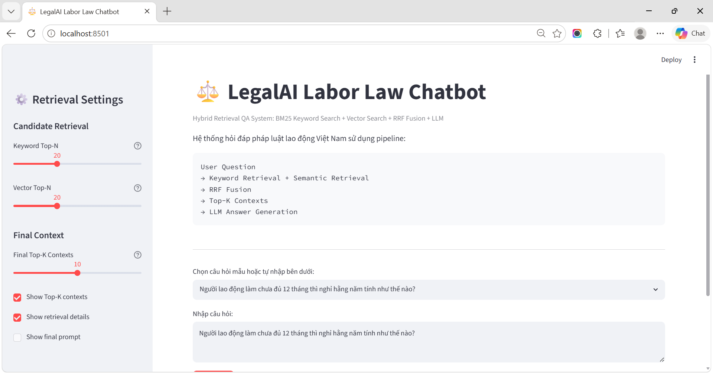
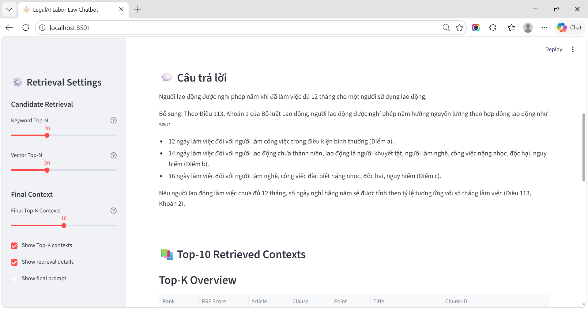
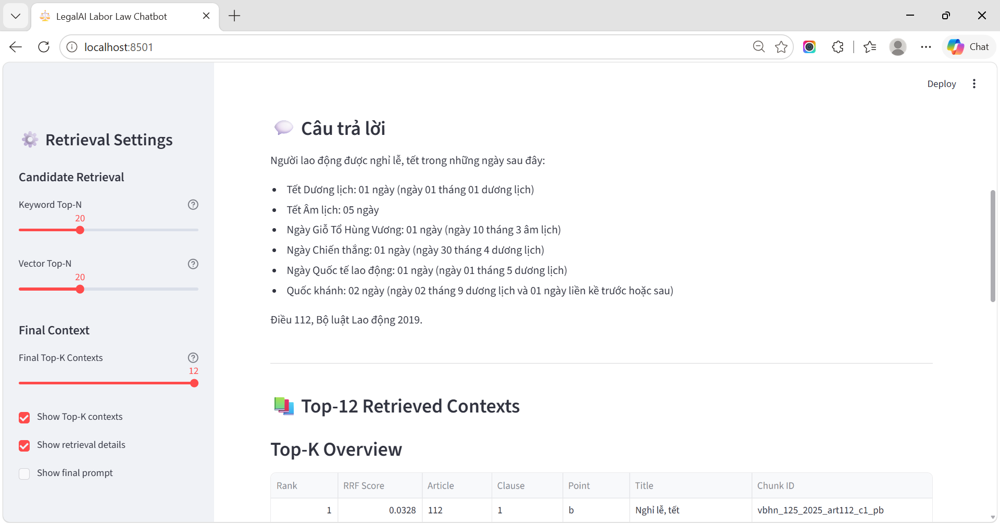
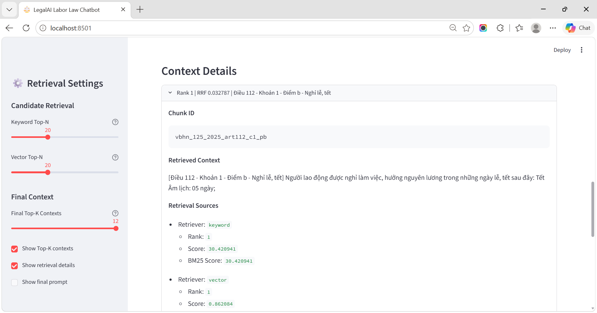

# LegalAI Labor Law Chatbot

A Vietnamese labor law chatbot using **Hybrid Retrieval** and **LLMs**.
The system retrieves relevant legal contexts from Vietnamese labor law documents, then generates answers grounded in the retrieved information.

## Overview

This project focuses on building a simple legal QA system for Vietnamese labor law.

Instead of asking the LLM directly, the system first searches legal documents using two retrieval methods:

* **Keyword Retrieval** with BM25
* **Semantic Retrieval** with vector embeddings

The two ranked result lists are then combined using **Reciprocal Rank Fusion (RRF)**. The final Top-K contexts are passed into the LLM to generate the answer.

## System Architecture

```text
User Question
→ Keyword Retrieval + Vector Retrieval
→ RRF Fusion
→ Top-K Contexts
→ LLM Answer
```

## Features

* Vietnamese labor law question answering
* BM25 keyword search
* Vector search with multilingual sentence embeddings
* Reciprocal Rank Fusion for hybrid ranking
* LLM answer generation based on retrieved contexts
* Streamlit interface
* Top-K retrieved context inspection
* Retrieval score details for debugging

## Demo

### Main Interface



### Example 1: Annual Leave Question



### Example 2: Public Holiday Question



### Top-K Retrieved Contexts



## Tech Stack

* Python
* Streamlit
* rank-bm25
* Sentence Transformers
* Groq LLM API
* Pandas / Parquet

## Project Structure

```text
LegalAI_Chatbox/
│
├── app.py
│
├── crawler/
│   
├── src/
│   ├── processing/      # document parsing and preprocessing
│   ├── retrieval/       # BM25, vector search, RRF, hybrid retriever
│   ├── llm/             # prompt builder and LLM client
│   ├── pipeline/        # query engine
│   └── ui/              # UI formatting helpers
│
├── data/
│   ├── raw/
│   ├── processed/
│   └── indexes/
│
├── assets/
│   ├── demo-home.png
│   ├── example-annual-leave.png
│   ├── example-holiday.png
│   └── topk-contexts.png
│
├── .env.example
├── requirements.txt
└── README.md

```

## Setup

### 1. Create virtual environment

```bash
python -m venv .venv
```

Activate it:

```bash
# Windows
.venv\Scripts\activate
```

```bash
# macOS / Linux
source .venv/bin/activate
```

### 2. Install dependencies

```bash
pip install -r requirements.txt
```

### 3. Create `.env`

```env
GROQ_API_KEY=your_groq_api_key_here
GROQ_MODEL=llama-3.1-8b-instant
```

## Usage

### 1. Process legal documents

```bash
python -m src.processing.writer
```

### 2. Build keyword index

```bash
python -m src.retrieval.keyword_index
```

### 3. Build vector index

```bash
python -m src.retrieval.vector_index
```

### 4. Run Streamlit app

```bash
streamlit run app.py
```

Open the local app at:

```text
http://localhost:8501
```

## Example Questions

```text
Người lao động được nghỉ phép năm khi nào?
```

```text
Người lao động được nghỉ lễ, tết những ngày nào?
```

```text
Người lao động làm chưa đủ 12 tháng thì nghỉ hằng năm tính như thế nào?
```

```text
Người sử dụng lao động có được sa thải người lao động đang nghỉ hằng năm không?
```

```text
Cưỡng bức lao động là gì?
```

## Current Status

Completed:

* Legal document preprocessing
* BM25 keyword index
* Vector embedding index
* Hybrid retrieval with RRF
* LLM answer generation
* Streamlit demo interface

Planned improvements:

* Better Vietnamese tokenization
* Legal context expansion
* GraphRAG for legal article relationships
* Retrieval and answer quality evaluation

## Disclaimer

This project is for educational and research purposes only.
The generated answers should not be considered official legal advice.

## Author

Developed by **Khang Le**.
